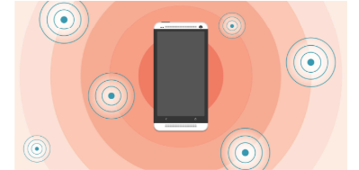
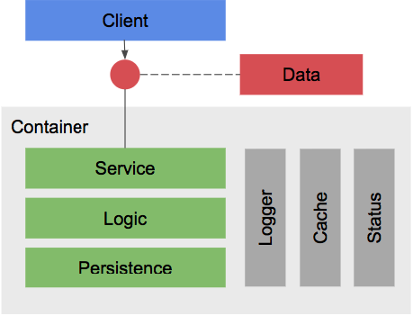

# Sample Beacons microservice in Node.js

This sample demonstrates how to develop and dockerize a microservice in Node.js using [Pip.Services](http://github.com/pip-services/pip-services) toolkit.

The is simple a microservice that does couple things:
* Keeps list of beacons with their IDs and locations
* Calculates estimated device position based on beacons it can see

To write the code we are going to use Pip.Services cross-language and cross-platform microservices toolkit.
If you are insterested to learn more about Pip.Services, please,
go to [http://github.com/pip-services/pip-services](http://github.com/pip-services/pip-services).

The microservice has the following design:

The implementation is divided into 9 steps:
* [Step 1](step1): Creating project structure
* [Step 2](step2): Defining data objects
* [Step 3](step3): Implementing persistence components with tests
* [Step 4](step4): Implementing controller compomnent with tests
* [Step 5](step5): Implementing HTTP service using command pattern
* [Step 6](step6): Wrapping the service into container
* [Step 7](step7): Implementing client SDK with tests
* [Step 8](step8): Dockerizing the microservice
* [Step 9](step9): Deploying to kubernetes (minikube)

Happy microservice development!

Sergey Seroukhov, Founder, [Conceptual Vision Consulting LLC](http://www.conceptual.vision)

